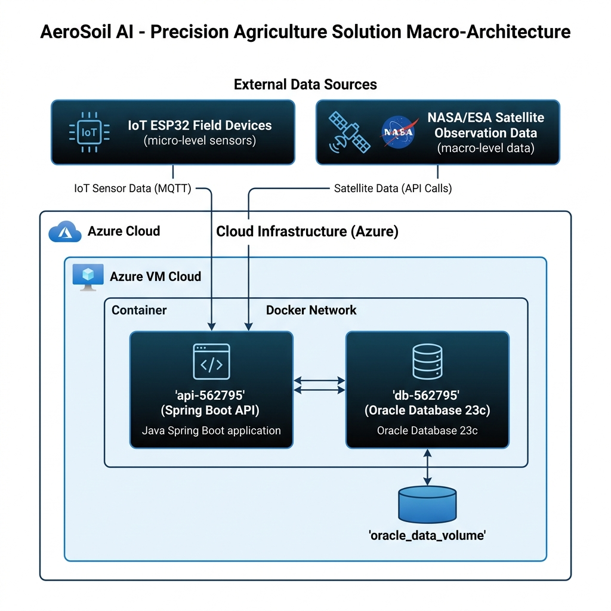

# AeroSoil AI




> O AeroSoil AI é uma plataforma inteligente de agricultura de precisão que conecta dados meteorológicos espaciais (NASA/ESA) a sensores locais de campo (ESP32) para otimizar os ciclos de irrigação, reduzindo desperdício e atuando de forma ativa contra o estresse hídrico no solo. A solução unifica a análise preditiva orbital e telemetria física terrestre.
---

## 💻 Pré-requisitos

Antes de começar, verifique se você atendeu aos seguintes requisitos:

* Você instalou a versão mais recente do **Docker** e **Docker Compose**.
* Você tem uma máquina **Windows, macOS ou Linux** (o ambiente é 100% compatível com todos estes sistemas operacionais através do Docker).
* Você leu a documentação e os scripts SQL de criação do banco e procedures localizados no diretório `/db`.

---

## 🚀 Instalando AeroSoil AI

Para instalar o AeroSoil AI, siga estas etapas:

Linux e macOS:
```bash
git clone https://github.com/Gabriel-Maciel06/GsDevops.git
cd GsDevops
docker compose up --build -d
```

Windows:
```bash
git clone https://github.com/Gabriel-Maciel06/GsDevops.git
cd GsDevops
docker-compose up --build -d
```

---

## ☕ Usando AeroSoil AI

Para usar o AeroSoil AI, siga estas etapas:

### 1. Monitorar a Inicialização e Logs
Após subir os contêineres em segundo plano (background), você pode verificar os logs de ambos os serviços digitando:
```bash
docker-compose logs -f
```

### 2. Acessar a Documentação Online (Swagger UI)
A API expõe a documentação interativa para teste de endpoints no navegador:
*   **Ambiente Local**: [http://localhost:8080/swagger-ui.html](http://localhost:8080/swagger-ui.html)
*   **Ambiente em Nuvem (Azure VM)**: [http://40.87.31.123:8080/swagger-ui.html](http://40.87.31.123:8080/swagger-ui.html)

### 3. Auditar a Segurança e Usuário dos Contêineres (whoami)
Para provar que os contêineres rodam com privilégios adequados, acesse seus terminais internos:
```bash
# Auditar contêiner da API (deve retornar 'appuser' e diretório '/app')
docker container exec -it api-562795 whoami
docker container exec -it api-562795 pwd
docker container exec -it api-562795 ls -l

# Auditar contêiner do Banco de Dados Oracle
docker container exec -it db-562795 whoami
docker container exec -it db-562795 pwd
```

### 4. Consultar Persistência de Dados via SELECT
Para demonstrar a persistência das informações no Oracle 23c Free, conecte-se diretamente na interface CLI do banco dentro do contêiner e execute consultas SQL:
```bash
docker container exec -it db-562795 sqlplus RM562795/oracle@//localhost:1521/FREEPDB1
```
No prompt do SQL*Plus, execute:
```sql
-- Verificar usuários cadastrados pela API
SELECT id_usuario, nome, email, perfil FROM TB_USUARIO;

-- Verificar leituras enviadas pelos sensores IoT
SELECT * FROM TB_LEITURA;
```

---

## 🤝 Colaboradores

Agradecemos às seguintes pessoas que contribuíram para este projeto:

| [<br><sub><b>Vitória Rodrigues Martins</b><br>RM 565160</sub>](#) | [<br><sub><b>Augusto Bonomo Júnior</b><br>RM 565155</sub>](#) | [<br><sub><b>Thomas Fontes</b><br>RM 562254</sub>](#) | [<br><sub><b>Gabriel Maciel</b><br>RM 562795</sub>](https://github.com/Gabriel-Maciel06) | [<br><sub><b>Matheus Pereira Molina</b><br>RM 563399</sub>](#) |
| :---: | :---: | :---: | :---: | :---: |

---

## 📝 Licença

Esse projeto está sob licença acadêmica da FIAP. Veja o arquivo [LICENSE](LICENSE) para mais detalhes.
